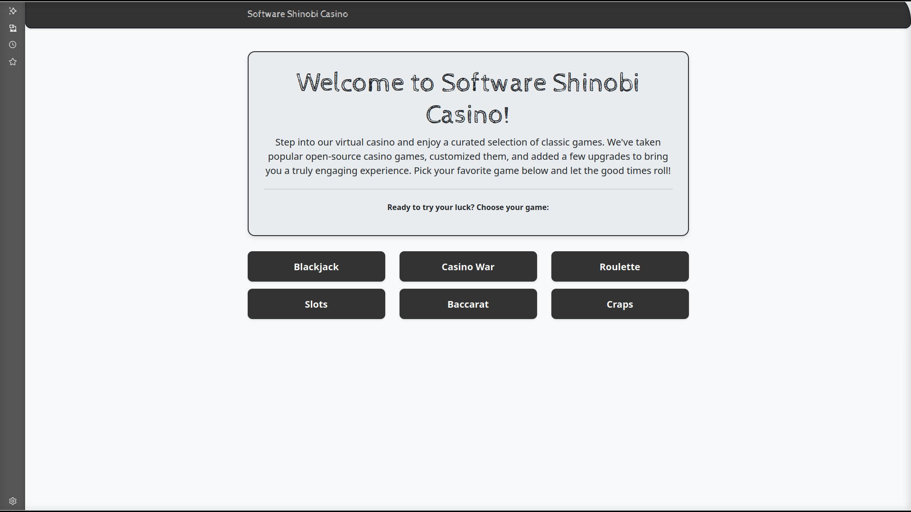

# The Shinobi Casino

Welcome to **The Shinobi Casino**, your premier destination for a collection of classic casino games, reimagined and enhanced for an unparalleled online gaming experience. Dive into a world of strategy, chance, and excitement, all designed for your entertainment.

## Games Included

Explore a variety of thrilling casino games, each offering unique challenges and opportunities for fun:

  * [**Blackjack**](https://casino.softwareshinobi.com/blackjack/index.html) - Test your strategy against the dealer and aim for 21\!
  * [**Casino War**](https://casino.softwareshinobi.com/casinowar/index.html) - A straightforward yet engaging card game where the highest card wins.
  * [**Roulette**](https://casino.softwareshinobi.com/roulette/index.html) - Place your bets on the wheel and watch the ball decide your fate.
  * [**Slots**](https://casino.softwareshinobi.com/slots/index.html) - Spin the reels and hope for winning combinations across multiple paylines.
  * [**Baccarat**](https://casino.softwareshinobi.com/baccarat/index.html) - Bet on the player, banker, or a tie in this elegant and fast-paced card game.
  * [**Craps**](https://casino.softwareshinobi.com/craps/index.html) - Roll the dice and experience the high energy and diverse betting options of the craps table.

-----

## Technologies Used

The Shinobi Casino is built using a modern and robust stack to ensure a smooth and responsive gaming environment. Here's a breakdown of the core technologies that power our platform:

| Technology         | Purpose                                                                             |
| :----------------- | :---------------------------------------------------------------------------------- |
| **HTML** | Provides the fundamental structure and content of all web pages.                    |
| **Bootstrap** | A powerful front-end framework used for responsive design and consistent UI components. |
| **Bootswatch** | Offers free themes for Bootstrap, enhancing the visual appeal and styling of the casino interface. |
| **jQuery** | A fast, small, and feature-rich JavaScript library that simplifies client-side scripting and DOM manipulation. |
| **Gemini Pro 2.5** | Utilized for advanced AI capabilities, potentially enhancing game logic or user interactions. |

-----

## Bugs, Issues, & Upgrades

We're constantly working to improve your gaming experience. For an overview of known **bugs**, **current issues**, and **planned upgrades**, please visit our dedicated page:

  * [**Bugs, Issues, & Upgrades**](issues.md) - Stay updated on known issues and upcoming features.

### The Big opportunities

[] blacjack especially and craps too, suffer from a double click issue. Maybe it's my mouse, but it's an issue.
[] half of the games have an shared wallet balance
[] slots needs to allow for multiple lines
[] craps bonus system is heavily broken

-----

## Demo

Ready to try your luck and experience The Shinobi Casino for yourself?

Visit our live casino site: [casino.softwareshinobi.com](https://casino.softwareshinobi.com/)
